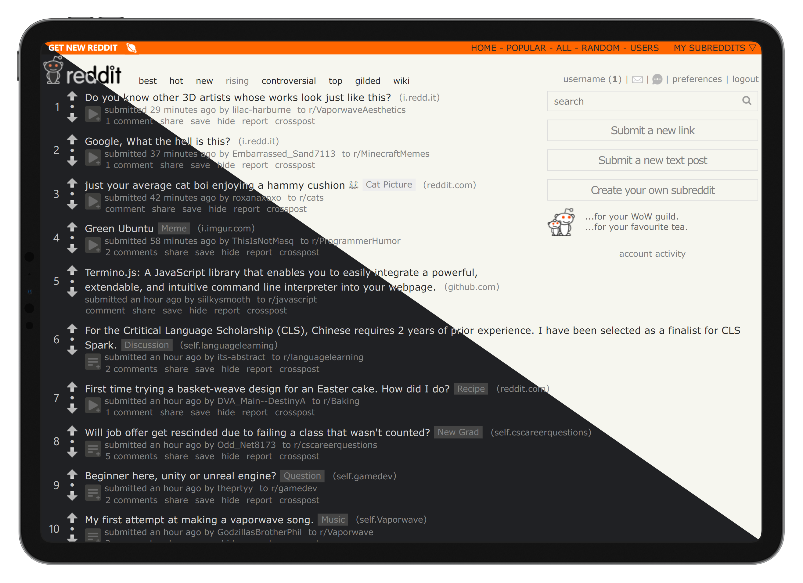

# Reddit Mod

> Flattened and minimalist theme for Reddit, with dark mode support.

[![Install directly with Stylus][badge]][1] [![license][license-badge]](LICENSE)

## Features

- Flattened and minimalist design
  - No more shadows and rounded corners
  - Less and understated colours and borders
- Two color schemes: Light and Dark
  - Light: HackerNews-like theme
  - Dark: carefully selected palette for dark mode
- Option to hide subreddits top bar
- Option to toggle layout between Stretched and Boxed
  - Stretched: content fills the entire screen (the default layout)
  - Boxed: content is centered and has a maximum width (of 1024px)

## Installation

1. Install [Stylus] extension for your browser.
2. [Install the css style with Stylus][1].
3. Go to [Reddit], navigate to `preferences`:
    - Uncheck `allow subreddits to show me custom themes` under the `display options` section
    - Turn off `Use new Reddit as my default experience` under the `beta options` section
4. Choose your preferred options in the settings page of the style.
5. Refresh the page and enjoy!

**Note**: There might be some corner cases that the style doesn't work well.
If you find any, please open an issue and I'll try to fix it.

## Related works

- [GitHub Mod]: A flattened and sharp userstyle for GitHub

## Credits

- [Reddit Minimal Dark] for making me interested in crafting myself a theme for Reddit
- [HackerNews] for the inspiration of the light theme

## License

**reddit-mod** © [Chawye Hsu](https://github.com/chawyehsu). Released under the [CC0-1.0](LICENSE) License.

> [Blog](https://chawyehsu.com) · GitHub [@chawyehsu](https://github.com/chawyehsu) · Twitter [@chawyehsu](https://twitter.com/chawyehsu)

[badge]: https://img.shields.io/badge/Install%20directly%20with-Stylus-00adad.svg?style=flat-square
[license-badge]: https://img.shields.io/github/license/chawyehsu/reddit-mod?style=flat-square
[1]: https://raw.githubusercontent.com/chawyehsu/reddit-mod/main/reddit-mod.user.css
[Stylus]: https://add0n.com/stylus.html
[Reddit]: https://www.reddit.com
[GitHub Mod]: https://github.com/chawyehsu/github-mod
[Reddit Minimal Dark]: https://uso.kkx.one/style/129171
[HackerNews]: https://news.ycombinator.com
